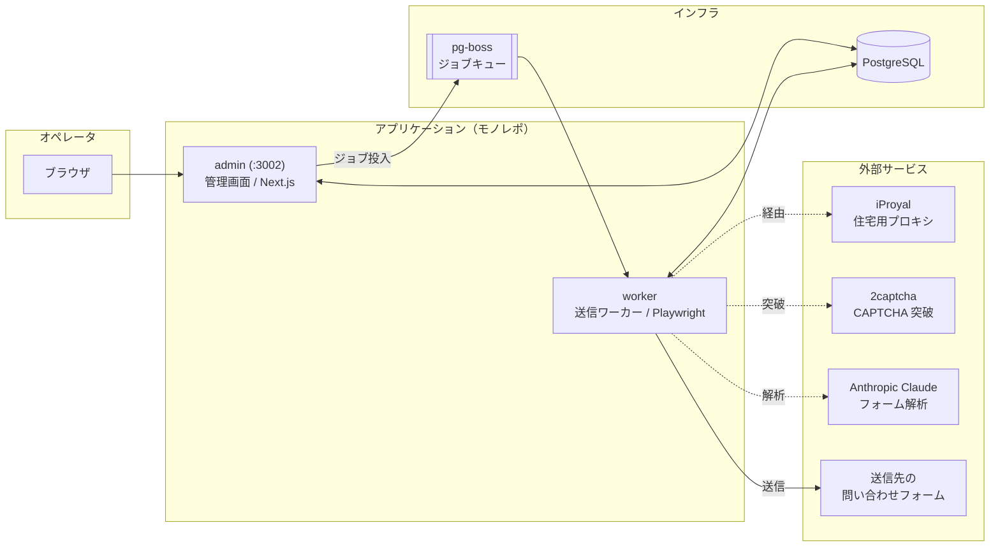
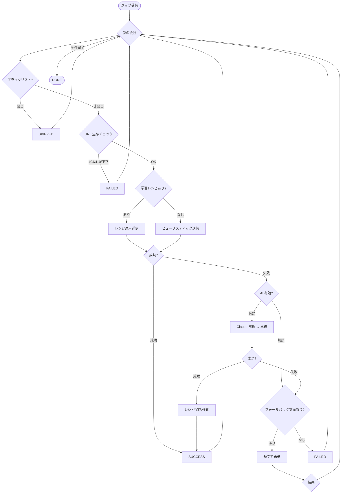
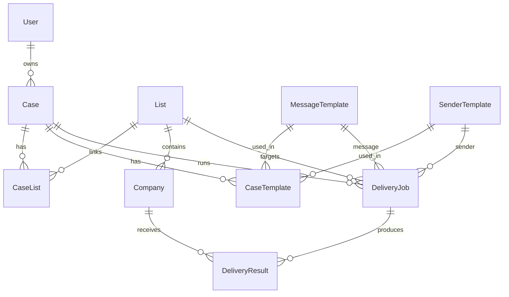

# 営業支援システム MVP（B2B フォーム営業自動化基盤）

企業の問い合わせフォームへ、営業メッセージを **自動で送信・追跡・改善** する B2B アウトバウンド営業基盤です。
会社リストの取り込みから、送信文面・送信元情報のテンプレート管理、送信ジョブの実行、結果の可視化までを一気通貫で行えます。

フォーム送信は単純な定型入力にとどまらず、**ヒューリスティック解析 → AI（Claude）解析 → ドメイン単位の学習レシピ** という多段構成で成功率を高めていきます。住宅用プロキシ（iProyal）と CAPTCHA 自動突破（2captcha）に対応し、実運用での到達性を確保します。

> ⚠️ **利用上の注意**：本システムは正当な営業活動・許諾済みの宛先への送信を前提としています。送信先サイトの利用規約・各種法令（特定電子メール法等）・レート制限を遵守して運用してください。

> © 2026 **aoi-webstudio**. All rights reserved.
> 本プロジェクト（ソースコード・設計・ドキュメント・関連成果物の一切）は **aoi-webstudio が完全に所有** し、その著作権は **すべて aoi-webstudio に帰属** します。詳細は [ライセンス・著作権](#ライセンス著作権) を参照してください。

---

## 目次

- [主な機能](#主な機能)
- [システム構成](#システム構成)
- [技術スタック](#技術スタック)
- [モノレポ構成](#モノレポ構成)
- [送信パイプライン（worker）](#送信パイプラインworker)
- [データモデル](#データモデル)
- [セットアップ](#セットアップ)
- [環境変数](#環境変数)
- [開発・起動](#開発起動)
- [ビルド・本番デプロイ](#ビルド本番デプロイ)
- [運用の流れ](#運用の流れ)
- [トラブルシューティング](#トラブルシューティング)
- [ライセンス・著作権](#ライセンス著作権)

---

## 主な機能

| カテゴリ | 機能 | 概要 |
|---|---|---|
| ダッシュボード | KPI / グラフ | 本日・今月の送信件数、成功率、進行中案件、日次/案件別の送信実績を可視化 |
| 案件管理 | 案件 CRUD | 案件（キャンペーン）単位でスポンサー・期間・ステータス（準備中/配信中/完了/停止）を管理 |
| リスト管理 | CSV 取込 | 会社名・フォーム URL・サイト URL・メール・業種を含む会社リストを CSV から一括取込 |
| テンプレート | 送信文章 | 件名・本文のメッセージテンプレートを管理（差し込み変数対応） |
| テンプレート | 送信元 | 会社名・担当者氏名（姓/名・かな/カナ）・住所・連絡先など送信元情報を管理 |
| 送信除外 | ブラックリスト | ドメイン／会社名による送信除外（手動登録・キーワード自動登録） |
| 自動送信 | ジョブ実行 | 案件 × リスト × テンプレートで送信ジョブを作成し、進捗をリアルタイム監視 |
| 自動送信 | 一時停止/中止 | 実行中ジョブの一時停止・中止リクエストに対応 |
| 自動送信 | フォールバック | 初回送信が失敗した社に、短文フォールバックテンプレートで再送 |
| 学習レシピ | AI 学習 | AI 送信が成功したフォーム入力プランをドメイン単位で保存・再利用（成功/失敗で強化・淘汰） |
| 効果測定 | URL クリック計測 | 送信文中の URL をトラッキング URL へ置換し、クリックを記録（リダイレクト用エンドポイントは別途用意が必要） |
| ログ | 配信結果 | 社単位の成功/失敗/スキップ・エラー種別・スクリーンショット・手動送信フラグを記録、CSV エクスポート |
| 認証 | ログイン | bcrypt + JWT（jose）によるセッション Cookie 認証 |

---

## システム構成



- **admin**：オペレータが操作する管理画面。案件・リスト・テンプレート・送信ジョブを管理し、`pg-boss` 経由で worker にジョブを投入します。
- **worker**：常駐プロセス。キューからジョブを受け取り、Playwright で実ブラウザを操作してフォーム送信を実行します。HTTP ポートは持ちません。
- **PostgreSQL**：全データの永続化先。`pg-boss` のジョブキューも同一 DB 上に構築されます。

---

## 技術スタック

| 領域 | 採用技術 |
|---|---|
| 言語 | TypeScript |
| フロントエンド | Next.js 15（App Router） / React 19 / Tailwind CSS 4 |
| 可視化 | Recharts |
| バックエンド | Next.js Server Actions / Route Handlers |
| ジョブキュー | pg-boss（PostgreSQL ベース） |
| ブラウザ自動化 | Playwright |
| AI | Anthropic Claude（`@anthropic-ai/sdk`） |
| DB / ORM | PostgreSQL / Prisma 6 |
| 認証 | bcryptjs（ハッシュ） + jose（JWT） |
| CSV | papaparse / iconv-lite（Shift_JIS 対応） |
| プロセス管理 | PM2（`ecosystem.config.cjs`） |
| パッケージ管理 | npm workspaces（モノレポ） |

---

## モノレポ構成

```
.
├── apps/
│   ├── admin/        管理画面（Next.js, :3002）
│   └── worker/       送信ワーカー（Playwright + pg-boss, 常駐）
├── packages/
│   └── db/           Prisma スキーマ・生成クライアント・シード（@mvp/db）
├── ecosystem.config.cjs   PM2 プロセス定義
├── tsconfig.base.json     共通 TypeScript 設定
└── package.json           ワークスペース定義・横断スクリプト
```

### worker の主要モジュール

| ファイル | 役割 |
|---|---|
| `index.ts` | エントリ。キュー購読・孤児ジョブ復旧・グレースフルシャットダウン |
| `job-processor.ts` | ジョブ単位の処理。社ごとの送信・リトライ・レシピ学習・件数集計 |
| `form-submitter.ts` | Playwright によるフォーム検出・入力・送信（ヒューリスティック） |
| `ai-form-analyzer.ts` | Claude によるフォーム解析と入力プラン（FillPlan）生成 |
| `captcha-solver.ts` | 2captcha 連携（reCAPTCHA v2/v3・Turnstile） |
| `queue.ts` | pg-boss の初期化・キュー定義 |

---

## 送信パイプライン（worker）

1 ジョブは「案件 × リスト × メッセージ/送信元テンプレート」で構成され、リスト内の各社へ順次送信します。



### 主要な仕様・ガード

- **多段送信**：ヒューリスティック送信 → 失敗時に Claude（AI）解析で再送 → 成功プランをドメイン単位の **学習レシピ（FormRecipe）** として保存し、次回以降は再利用。
- **レシピの強化と淘汰**：レシピは成功/失敗カウントを持ち、連続失敗が閾値（3 回）に達すると自動で無効化し、次回 AI で作り直します。
- **URL 生存チェック**：送信前に GET で URL の生死を判定。404/410・不正 URL のみ確実に弾き、403/5xx/タイムアウト等は通常送信へ進めて偽陰性を回避。
- **孤児ジョブ復旧**：ワーカー再起動・クラッシュ時に `RUNNING` のまま残ったジョブを起動時に再投入（送信済みの社はスキップされ二重送信を防止）。
- **一時停止 / 中止**：`pauseRequested` / `cancelRequested` フラグにより、実行中ジョブを管理画面から制御。
- **レート制御**：社間に待機（`INTER_COMPANY_DELAY_MS`）、1 社あたり最大処理時間（`PER_COMPANY_TIMEOUT_MS`）・最大試行回数（`MAX_ATTEMPTS`）を設定。
- **証跡**：`WORKER_SCREENSHOT=true` のとき送信時の全画面スクリーンショット（PNG）を保存。

---

## データモデル



| モデル | 説明 |
|---|---|
| `User` | 管理画面ユーザ（bcrypt ハッシュ） |
| `Case` | 案件（キャンペーン）。ステータス・期間・スポンサー |
| `List` / `Company` | 会社リストと各社（フォーム URL・サイト・メール・業種） |
| `MessageTemplate` | 送信文章テンプレート（件名・本文） |
| `SenderTemplate` | 送信元情報（会社・担当者氏名/かな/カナ・住所内訳・連絡先） |
| `BlacklistEntry` | 送信除外（ドメイン / 会社名、手動 / キーワード自動） |
| `DeliveryJob` | 送信ジョブ。件数集計・停止/中止フラグ・URL 計測有無 |
| `DeliveryResult` | 社単位の送信結果。エラー種別・スクショ・クリック数・手動送信 |
| `FormRecipe` | ドメイン単位の学習済みフォーム入力プラン |
| `CaseList` / `CaseTemplate` | 案件とリスト/テンプレートの関連（中間テーブル） |
| `Setting` | キー・バリュー設定 |

ステータス enum：案件（`PREPARING`/`RUNNING`/`COMPLETED`/`STOPPED`）、ジョブ（`PENDING`/`RUNNING`/`PAUSED`/`DONE`/`FAILED`/`CANCELLED`）、結果（`PENDING`/`RUNNING`/`SUCCESS`/`FAILED`/`SKIPPED`）。

---

## セットアップ

### 前提

- Node.js 20 以上 / npm
- PostgreSQL 14 以上（`pg-boss` のジョブキューも同 DB を使用）
- Playwright 実行環境（worker。`npx playwright install --with-deps chromium` でブラウザ取得）

### 手順

```bash
# 1. 依存関係のインストール（ワークスペース一括）
npm install

# 2. 環境変数の用意
cp .env.example .env
#   → DATABASE_URL / SESSION_SECRET などを設定（後述）

# 3. Prisma クライアント生成 & マイグレーション
npm run db:generate
npm run db:migrate

# 4. 初期データ投入（管理ユーザ等）
npm run db:seed

# 5. Playwright ブラウザ取得（worker 用）
npx playwright install --with-deps chromium
```

---

## 環境変数

`.env`（リポジトリ直下）に定義し、各アプリは `dotenv-cli` 経由で読み込みます。

| 変数 | 必須 | 説明 |
|---|:---:|---|
| `DATABASE_URL` | ✅ | 通常クエリ用の接続文字列（トランザクションプーラ経由可） |
| `DIRECT_URL` | ✅ | マイグレーション用の直結 URL（pgbouncer を経由しない接続） |
| `SESSION_SECRET` | ✅ | セッション JWT 署名鍵（64 文字程度のランダム文字列） |
| `PROXY_SERVER` |  | iProyal 住宅用プロキシのエンドポイント |
| `PROXY_USERNAME` / `PROXY_PASSWORD` |  | プロキシ認証情報（国指定等） |
| `TWOCAPTCHA_API_KEY` |  | 2captcha の API キー。未設定なら CAPTCHA 突破をスキップ |
| `ANTHROPIC_API_KEY` |  | Claude の API キー。未設定なら AI 再送をスキップ |
| `TRACK_BASE_URL` |  | URL クリック計測リダイレクト（`/r/[id]`）の公開ベース URL。計測を使う場合は別途リダイレクト用エンドポイントを用意 |

> `DATABASE_URL` が pgbouncer（トランザクションプーラ, port 6543）を指す場合、`prisma migrate` は advisory lock を取得できないため、`DIRECT_URL` にセッションプーラ（port 5432, pgbouncer なし）を指定してください。

---

## 開発・起動

### 全プロセス同時起動（推奨）

```bash
npm run dev
```

`admin` / `worker` が同時に起動し、ターミナルに色分けログが表示されます。

- **admin** … <http://localhost:3002>（管理画面）
- **worker** … 常駐プロセス（HTTP ポートなし。pg-boss 経由でジョブを受信）

### 個別起動

```bash
npm run dev:admin    # :3002
npm run dev:worker   # worker（ポートなし）
```

### データベース関連スクリプト

```bash
npm run db:generate       # Prisma クライアント生成
npm run db:migrate        # マイグレーション（開発）
npm run db:migrate:deploy # マイグレーション（本番適用）
npm run db:push           # スキーマを DB へ反映（マイグレーション無し）
npm run db:studio         # Prisma Studio 起動
npm run db:seed           # 初期データ投入
```

---

## ビルド・本番デプロイ

```bash
# ビルド（Prisma 生成 + admin の本番ビルド）
npm run build

# PM2 で全プロセスを常駐起動（リポジトリ直下で）
pm2 start ecosystem.config.cjs
```

`ecosystem.config.cjs` は `mvp-admin` / `mvp-worker` の 2 プロセスを定義しています（さくらの VPS 等でのネイティブデプロイ想定）。各プロセスは npm スクリプト内の `dotenv-cli` 経由で直下の `.env` を読み込みます。

```bash
npm run start            # 全プロセス（concurrently）
npm run start:admin      # :3002
npm run start:worker     # worker
```

---

## 運用の流れ

| タイミング | 作業 |
|---|---|
| 送信前 | ブラックリスト更新・新規リスト取込（CSV）・テンプレート整備 |
| 送信実行 | 送信ジョブ作成（案件 × リスト × テンプレート）→ 進捗監視 |
| 実行中 | 必要に応じて一時停止 / 中止。失敗社は AI 再送・フォールバックで自動リカバリ |
| 日次 | ダッシュボードで送信件数・成功率・異常をチェック |
| 週次 | 配信結果を CSV エクスポートして集計、取引先の反応と突合 |
| 案件終了時 | 案件ステータスを「配信中 → 完了」へ変更 |

---

## トラブルシューティング

| 症状 | 対処 |
|---|---|
| `prisma migrate` が advisory lock で失敗 | `DIRECT_URL` を pgbouncer 非経由（port 5432）の直結 URL に設定 |
| ポート競合（`EADDRINUSE :3002`） | 既存プロセスを停止（`netstat` 等で PID 特定後に kill） |
| AI 再送が動作しない | `ANTHROPIC_API_KEY` を設定。未設定時は AI 解析をスキップ |
| CAPTCHA を突破できない | `TWOCAPTCHA_API_KEY` を設定。残高・対応種別を確認 |
| フォーム送信が軒並み失敗 | プロキシ設定・送信先 URL の品質・Playwright ブラウザの導入を確認 |
| 再起動後にジョブが進まない | worker 起動時の孤児ジョブ復旧ログを確認（`RUNNING` ジョブを自動再投入） |

---

> 本リポジトリは MVP（検証用）です。実運用に際しては、送信レート・宛先の許諾・各種法令遵守の運用ルールを別途整備してください。

---

## ライセンス・著作権

**本プロジェクトは aoi-webstudio が完全に所有します。**

- 本リポジトリに含まれるすべての成果物（ソースコード、設計・アーキテクチャ、データモデル、ドキュメント、図表、設定ファイル、その他一切の関連物）の権利は、**完全かつ排他的に aoi-webstudio に帰属** します。
- 著作権およびその他一切の知的財産権（著作者人格権を含む派生権利、ノウハウ、商標等を含む）は、**すべて aoi-webstudio が保有** します。
- aoi-webstudio の事前の書面による許諾なく、本プロジェクトの全部または一部を、複製・改変・再配布・公衆送信・販売・譲渡・貸与・リバースエンジニアリング・二次利用することを禁止します。
- 本プロジェクトはオープンソースではなく、**プロプライエタリ（非公開・専有）ソフトウェア** です。明示的に許諾された範囲を超える利用権は一切付与されません。

```
Copyright (c) 2026 aoi-webstudio. All rights reserved.

本ソフトウェアおよび関連する一切の成果物は aoi-webstudio の専有物であり、
その著作権を含む全権利は aoi-webstudio に帰属します。
aoi-webstudio の書面による事前の許諾なく、いかなる目的においても
利用・複製・改変・再配布することを禁じます。
```

お問い合わせ・利用許諾に関するご相談は aoi-webstudio までご連絡ください。
